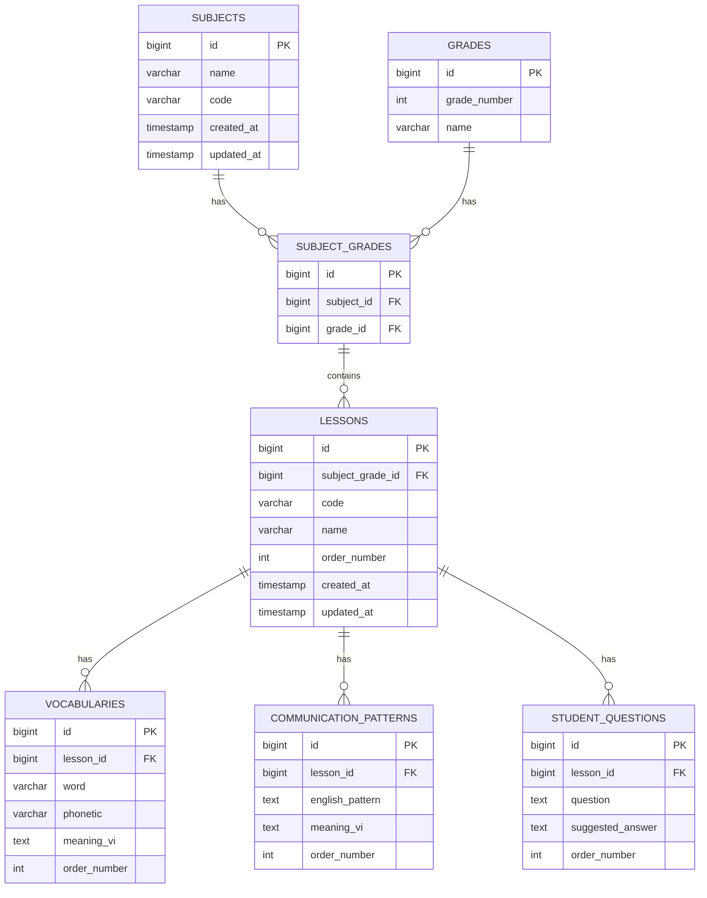

# Database Schema - Module Trợ giảng

```mermaid
erDiagram

    SUBJECTS {
        bigint id PK
        varchar name
        varchar code
        timestamp created_at
        timestamp updated_at
    }

    GRADES {
        bigint id PK
        int grade_number
        varchar name
    }

    SUBJECT_GRADES {
        bigint id PK
        bigint subject_id FK
        bigint grade_id FK
    }

    LESSONS {
        bigint id PK
        bigint subject_grade_id FK
        varchar code
        varchar name
        int order_number
        timestamp created_at
        timestamp updated_at
    }

    VOCABULARIES {
        bigint id PK
        bigint lesson_id FK
        varchar word
        varchar phonetic
        text meaning_vi
        int order_number
    }

    COMMUNICATION_PATTERNS {
        bigint id PK
        bigint lesson_id FK
        text english_pattern
        text meaning_vi
        int order_number
    }

    STUDENT_QUESTIONS {
        bigint id PK
        bigint lesson_id FK
        text question
        text suggested_answer
        int order_number
    }

    SUBJECTS ||--o{ SUBJECT_GRADES : "has"
    GRADES ||--o{ SUBJECT_GRADES : "has"

    SUBJECT_GRADES ||--o{ LESSONS : "contains"

    LESSONS ||--o{ VOCABULARIES : "has"
    LESSONS ||--o{ COMMUNICATION_PATTERNS : "has"
    LESSONS ||--o{ STUDENT_QUESTIONS : "has"
```
